# Overview
- Name: SportShop

- Start time : from the announcement of the exercise in the Sun scholarship program

- Development time: 7 days (3/7/2023 - 9/7/2023 although the deadline is 11 days, there is a clash with the JLPT exam schedule)

- Reason for development: to practice web programming skills and combine passion for sports, hence the name SportShop

- Role: Full-stack

- Technologies used:

    - Frontend: [Reactjs](https://react.dev), [React-Redux](https://react-redux.js.org), 
    [React-Dom](https://legacy.reactjs.org/docs/react-dom.html), 
    [react-toastify](https://www.npmjs.com/package/react-toastify), 
    [axios](https://www.npmjs.com/package/axios), 
    [jwt-decode](https://www.npmjs.com/package/jwt-decode)

    - Backend: [Nodejs](Node.js), 
    [MongoDB](https://www.mongodb.com), 
    [cloudinary](https://cloudinary.com), 
    [stripe](https://stripe.com/docs/api/checkout/sessions/retrieve), 
    [jsonwebtoken](https://www.npmjs.com/package/jsonwebtoken), 
    [bcrypt](https://www.npmjs.com/package/bcrypt), 
    [joi](https://www.npmjs.com/package/joi), 
    [express](https://www.npmjs.com/package/express), 
    [moment](https://www.npmjs.com/package/moment)
# Features

## Register
A user registration feature that requires three pieces of data: name, email, and password. If a user tries to create an account using an email that is already associated with an existing account, an error will occur. Similarly, if the password does not meet the required format, an error will be displayed.

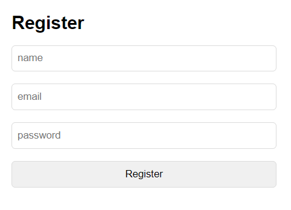
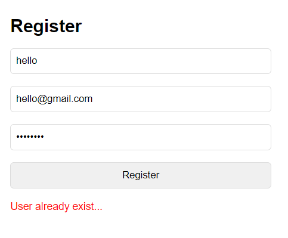
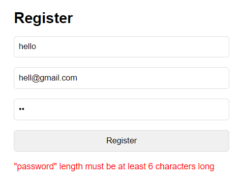

If the user registration process is successful, the account information will be saved in MongoDB.

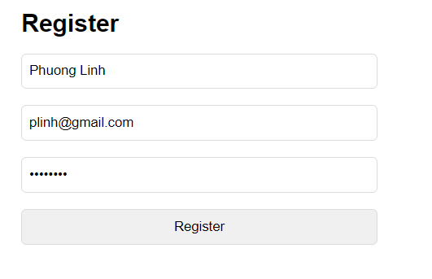
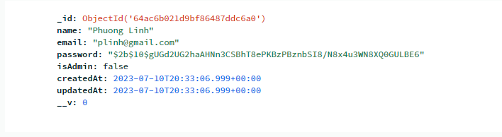

## Login

There are similar functions to the registration process called "Login" where users only need to input their email and password. If the provided email or password is incorrect, an error message will be displayed.


## Cart
The Home page displays the products on sale.

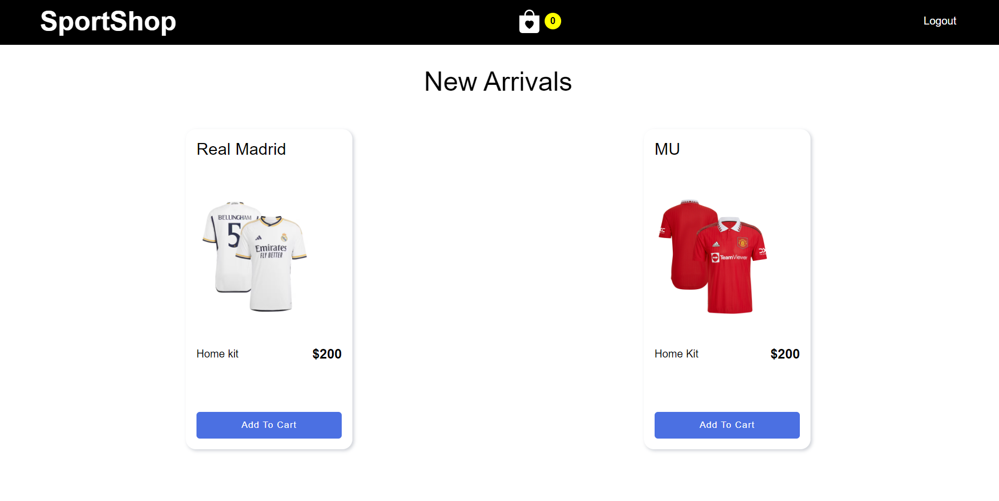

User can select Add To Cart to add products to cart.

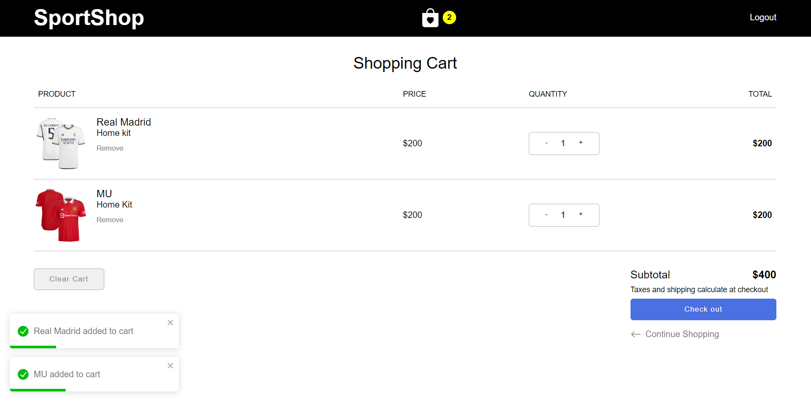
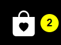

You can press the `+` `-` button to increase or decrease the number.

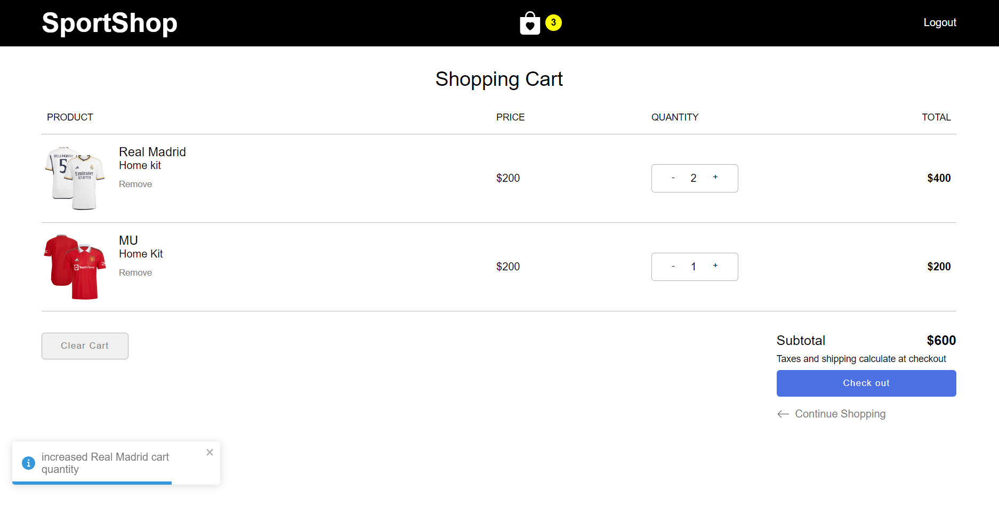

## Checkout
Click Check out to pay.

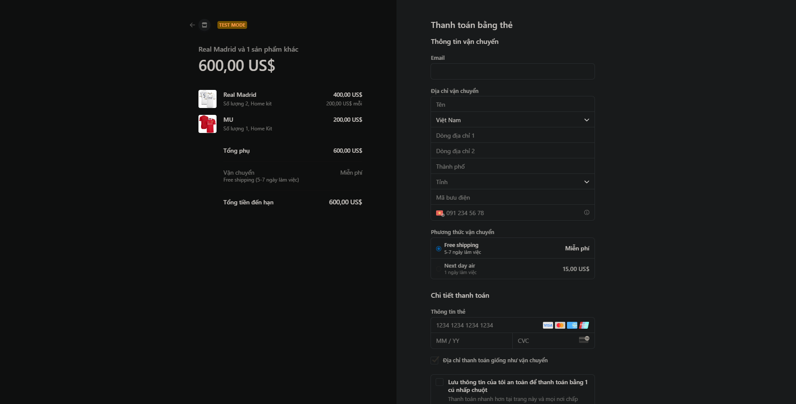

Fill in the payment information. You can choose the shipping option if you choose Next day air, it will cost an additional 15.00 US$ for shipping.

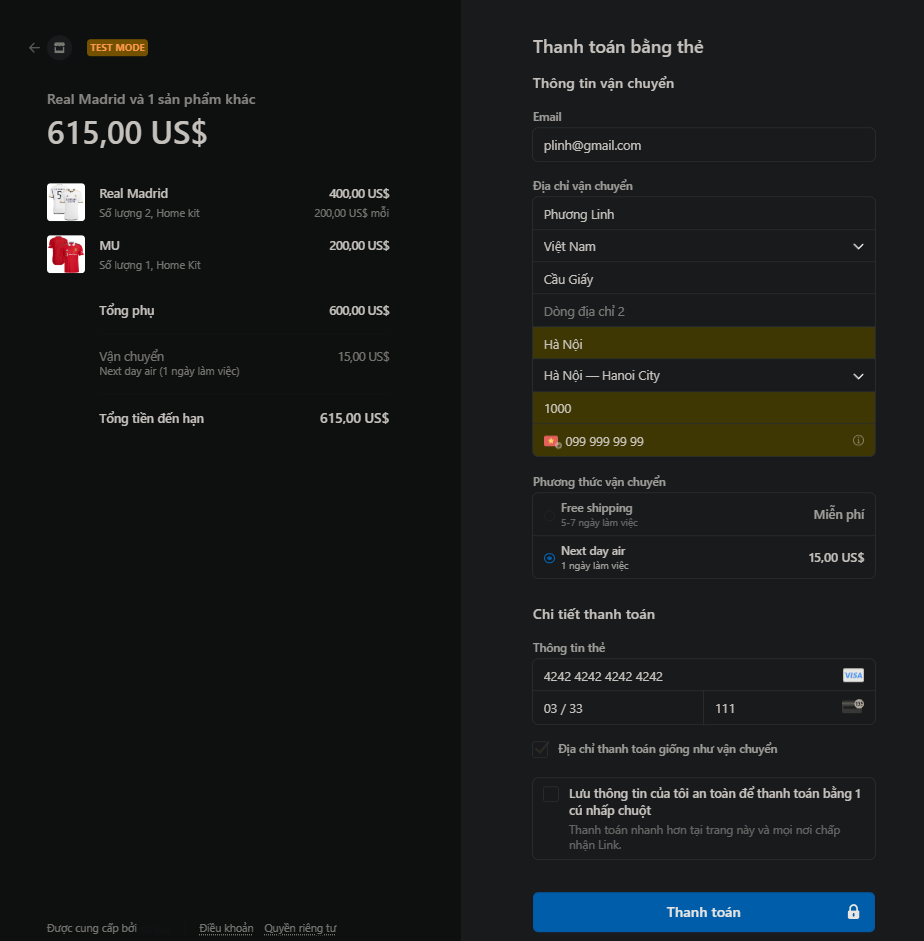

Check out is successful and the system will delete the existing carts.

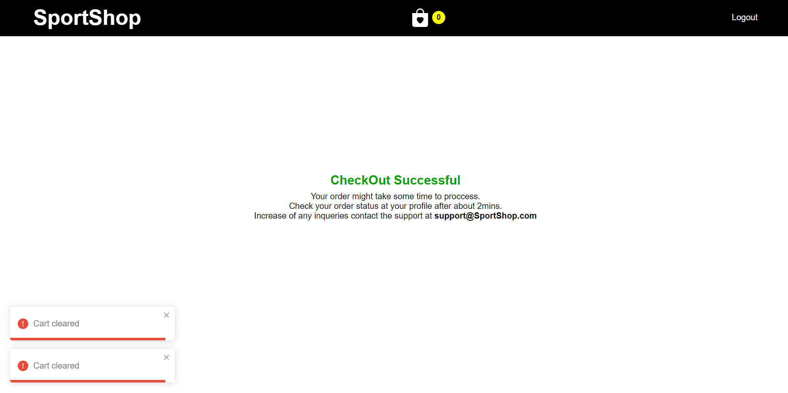

Check data on MongoDB.

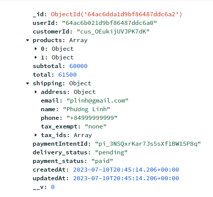

## Admin

Login with Admin account will have features to control purchases.

### Summary

#### OverView
Admin can see the sales status of User, Order and Earnings in the last 5 months.

#### Lastest Transcations
Admin can see the lastest Orders.

#### All Time
Admin can see the overall User, Product, Order, Earning.

#### Chart
Admin can observe the sales status in the last 7 days.

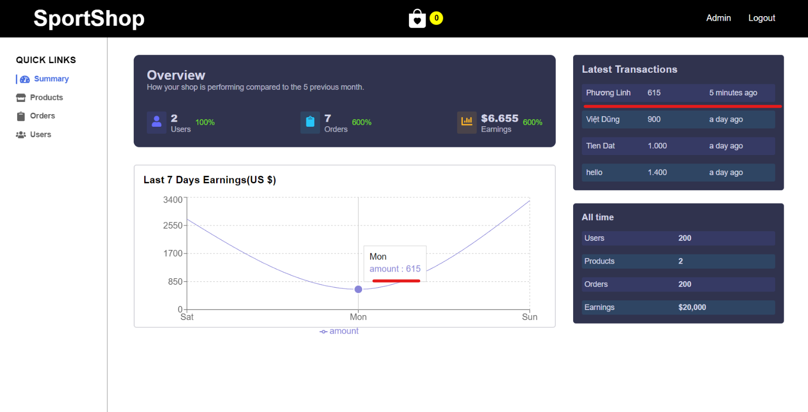

### Products

Admin can view existing products, edit information, create new product, or view products.

- Create product
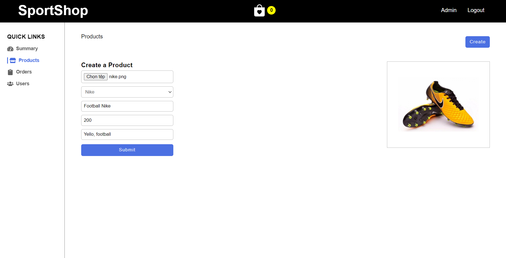

- Success
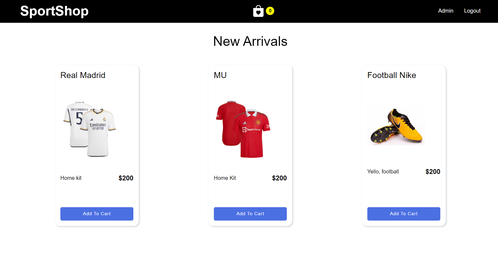

- View product
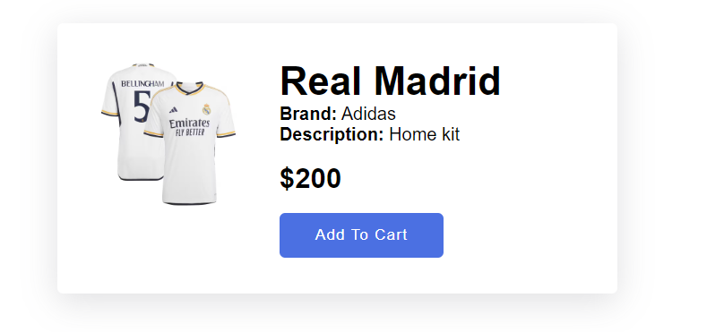

- Delete product
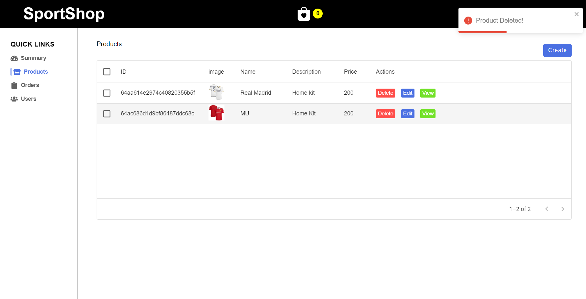

### Orders
In Orders Admin can also use the same features as in products:
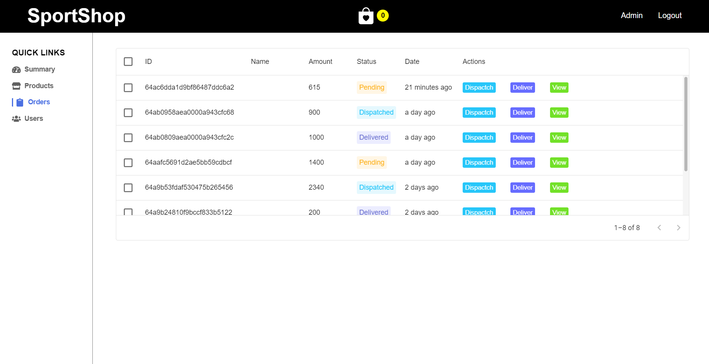

Admin can click Dispatch to switch pending status to Dispatched or click Deliver to switch to Delivered status

- View
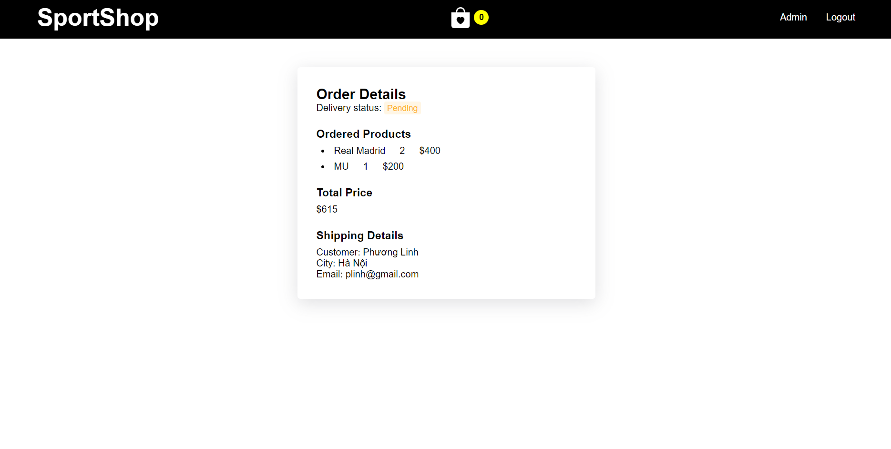

### Users

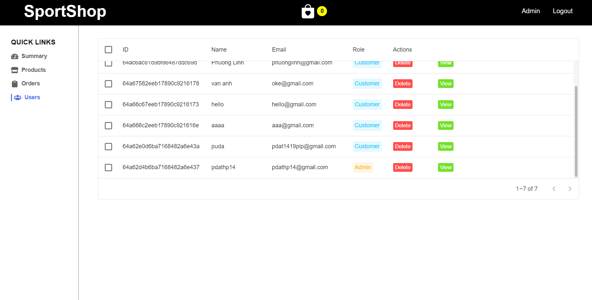

Admin can sort by ID, name, email.

- Delete User
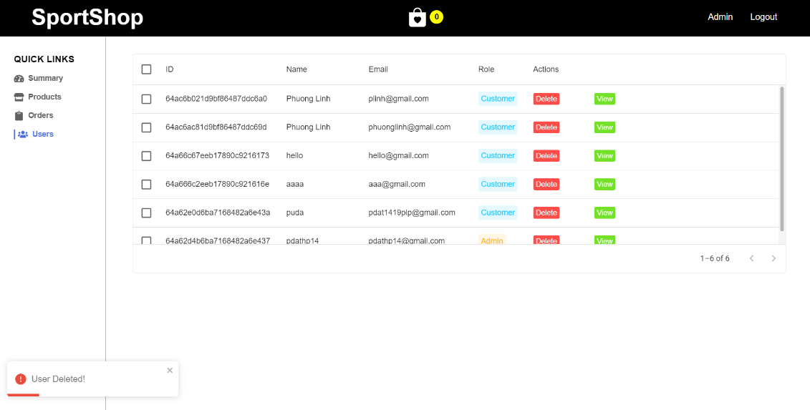

- View User
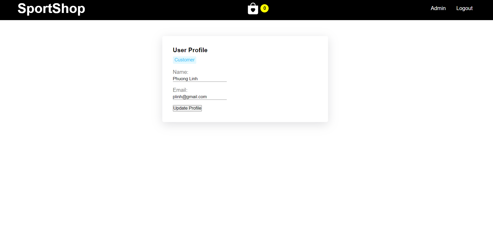

# Settings

Make sure you have installed `nodejs`, `npm`, `npx` or `yarn`

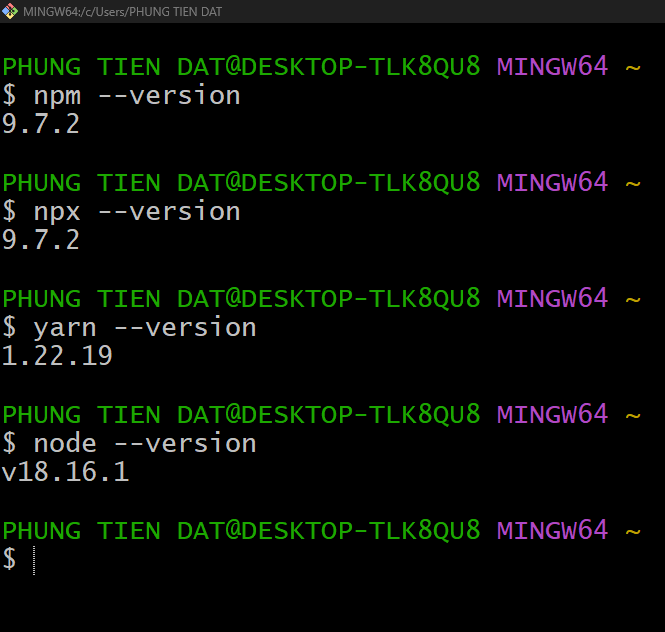

you can use

```sh
npm i
```
or
```sh
yarn
```
to pull the libraries used in the project recorded in the log file to your computer

Then, start build website in localhost
```sh
npm start
```

> It's the frontend, read the [backend](https://github.com/Puda14/Sport-Shop-Backend) to better understand the project

Some information about the features:
- [icon](https://icons.getbootstrap.com)
- [font](https://fonts.google.com/specimen/Nunito+Sans?query=Nunito)
- [cloudinary](https://console.cloudinary.com/console)
- [react-icon](https://react-icons.github.io/react-icons/)
- [chart](https://recharts.org/en-US/examples)
- [table](https://mui.com/material-ui/react-table/#basic-table)
- [dialog](https://mui.com/material-ui/react-dialog/#basic-dialog)
- [backend](https://github.com/Puda14/Sport-Shop-Backend)

> [Live Demo](https://sport-shop-96cf4531ead4.herokuapp.com)

To avoid creating too much data, I don't give product data => just look through there are no rows to order, can still register and try login. When I need a demo, I will put the product up for testing